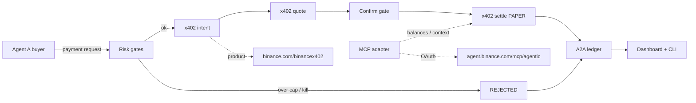

# PayPulse

Track A product for the **Binance Agent OS Mini Hackathon 2026**.

**Payment Workflows** — Agent-to-Agent (A2A) payments using **Binance x402** programmable payments, with **MCP** for balances / settlement context.

## Dual-rail Agent OS

| Rail | Role | Endpoint |
|------|------|----------|
| **x402** | Programmable A2A payments (intent → quote → confirm → settle) | `https://www.binance.com/binancex402` |
| **MCP** | Account / settlement context (OAuth, no device API keys) | `https://agent.binance.com/mcp/agentic` (`oauth_client_id=grok`) |

Documented x402 default daily cap: **$20/day** — labeled as a **documented default, not a guarantee**. Confirm live quotas in the Binance App / wallet settings.

Paper/mock when live is unavailable; every mock path is labeled. **No withdrawals. No secrets.**

## Features

- Create payment request (from/to agent ids, amount, asset USDT/USDC, memo)
- Risk: max payment size, daily spend cap, kill-switch, require confirm
- Ledger of A2A payments + status (`PENDING` / `QUOTED` / `AWAITING_CONFIRM` / `CONFIRMED_PAPER` / `FAILED` / `REJECTED`)
- CLI `npm run demo` — at least 2 successful paper A2A + at least 1 rejected (over cap)
- Vite + React dashboard: agents, pending, ledger, adapter status

## Architecture



## Quick start

> **Paper/sim — not live B402.** Keep `PAYPULSE_MODE=paper` for demos and judging.

```bash
git clone https://github.com/herewegoagain4436-creator/paypulse-binance-agent-os.git
cd paypulse-binance-agent-os
npm install
npm run demo
npm run dev
```

Copy `.env.example` to `.env` if you want to tweak thresholds. Keep `PAYPULSE_MODE=paper` for demos.

## Agent OS usage

See **AGENT_OS_NOTES.md** for x402 caps, MCP OAuth, scopes, and doc URLs.

Grok MCP registration (reference):

```text
add binance-mcp-server with url=https://agent.binance.com/mcp/agentic oauth_client_id=grok
```

Do **not** open the MCP endpoint in a browser.

x402 product: https://www.binance.com/binancex402

## Scripts

| Script | Purpose |
|--------|--------|
| `npm run demo` | 2 paper A2A successes + 1 over-cap reject |
| `npm run dev` | Vite dashboard (port 5174) |
| `npm run cli` | JSON once-run / pay helpers |
| `npm run build` | Typecheck + Vite build |

## Key files

- `src/core/` — types, risk, ledger, workflow (intent→quote→confirm→settle)
- `src/adapters/x402Payments.ts` — x402 payments adapter (paper/mock/live probe)
- `src/adapters/mcpAgentic.ts` — MCP settlement context adapter
- `src/adapters/agentOsFacade.ts` — dual-rail facade (x402 + MCP)
- `src/cli/demo.ts` — demo runner
- `src/ui/` — React dashboard
- `src/data/fixtures/` — agents + service offers
- `AGENT_OS_NOTES.md`, `DEMO.md`, `BRIEF.md`

## Disclaimer

Not financial advice. Paper and mock settlements are **not** live Binance x402 payments. Live Agent OS actions require user confirmation / wallet OAuth; agentic sub-accounts have **no withdrawal scope**. The x402 **$20/day** figure cited in-code is a **documented default** from public materials — **not an invented guarantee**; confirm live quotas in the Binance App / wallet settings.
