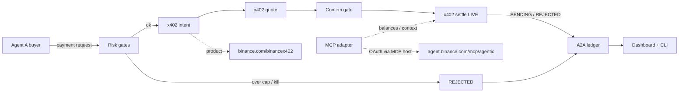

# PayPulse

Track A product for the **Binance Agent OS Mini Hackathon 2026**.

**Payment Workflows** — Agent-to-Agent (A2A) payments using **Binance x402** programmable payments, with **MCP** for balances / settlement context.

**Live default.** MCP hosts flexible (Grok is one optional example). Honest live statuses — never silent paper fills.

## Dual-rail Agent OS

| Rail | Role | Endpoint |
|------|------|----------|
| **x402** | Programmable A2A payments (intent → quote → confirm → settle) | `https://www.binance.com/binancex402` |
| **MCP** | Account / settlement context (OAuth via MCP host, no device API keys) | `https://agent.binance.com/mcp/agentic` |

Documented x402 default daily cap: **USD20/day** — labeled as a **documented default, not a guarantee**. Confirm live quotas in the Binance App / wallet settings.

Live path returns `PENDING` / `AWAITING_CONFIRM` / `REJECTED` honestly. Paper/mock only when `PAYPULSE_MODE=paper|mock`. **No withdrawals. No secrets. No fake live settles.**

## Features

- Create payment request (from/to agent ids, amount, asset USDT/USDC, memo)
- Risk: max payment size, daily spend cap, kill-switch, require confirm
- Ledger of A2A payments + status (`PENDING` / `QUOTED` / `AWAITING_CONFIRM` / `CONFIRMED_PAPER` / `SUBMITTED_MOCK` / `FAILED` / `REJECTED`)
- Explainable **why pay / why reject** rationales (rules templates — no LLM required)
- CLI live smoke: >=2 payment attempts + >=1 risk reject
- Vite + React dashboard: agents, pending, ledger, **live adapter statuses**, rationales
- Judge script: **JUDGE.md** (60–90s)

## Architecture



## Quick start

> **Live-first.** Default `PAYPULSE_MODE=live`. Opt into paper with `PAYPULSE_MODE=paper` only when you want local fills.

```bash
git clone https://github.com/herewegoagain4436-creator/paypulse-binance-agent-os.git
cd paypulse-binance-agent-os
npm install
npm run demo
npm run dev
```

Copy `.env.example` to `.env` if you want to tweak thresholds. Keep live for judging smoke unless you intentionally switch.

## Agent OS usage

See **AGENT_OS_NOTES.md** for x402 caps, MCP OAuth, scopes, and doc URLs.
Judge walkthrough: **JUDGE.md**.

MCP host registration (host-flexible):

```text
add binance-mcp-server with url=https://agent.binance.com/mcp/agentic oauth_client_id=<your-host-id>
```

Example: `oauth_client_id=grok` for Grok. Do **not** open the MCP endpoint in a browser.

x402 product: https://www.binance.com/binancex402

## Scripts

| Script | Purpose |
|--------|--------|
| `npm run demo` | Live smoke: >=2 A2A attempts + >=1 over-cap reject |
| `npm run dev` | Vite dashboard (port 5174) |
| `npm run cli` | JSON once-run / pay helpers |
| `npm run build` | Typecheck + Vite build |

## Key files

- `src/core/` — types, risk, ledger, workflow, **reasoning** (intent→quote→confirm→settle)
- `src/adapters/x402Payments.ts` — x402 payments adapter (live/paper/mock)
- `src/adapters/mcpAgentic.ts` — MCP settlement context adapter
- `src/adapters/agentOsFacade.ts` — dual-rail facade (x402 + MCP)
- `src/cli/demo.ts` — live smoke runner
- `src/ui/` — React dashboard
- `src/data/fixtures/` — agents + service offers
- `JUDGE.md`, `AGENT_OS_NOTES.md`, `DEMO.md`, `BRIEF.md`

## Disclaimer

Not financial advice. Live Agent OS actions require user confirmation / wallet OAuth; agentic sub-accounts have **no withdrawal scope**. The x402 **USD20/day** figure cited in-code is a **documented default** from public materials — **not an invented guarantee**; confirm live quotas in the Binance App / wallet settings. Paper/mock settles are opt-in only and never claimed as live fills.
